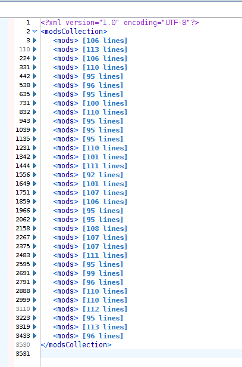
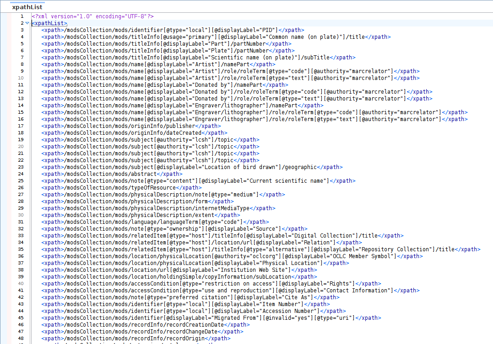
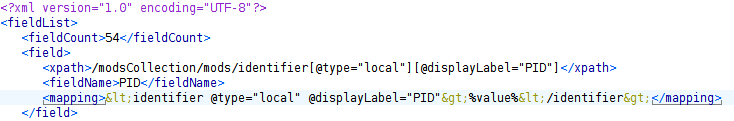
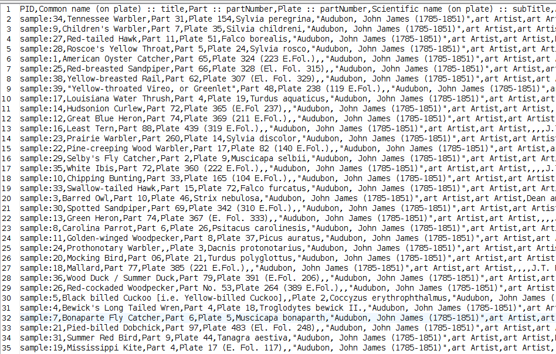
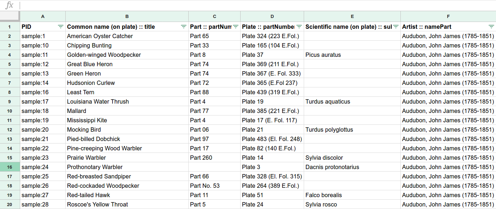

# XML to CSV

## Overview

This repository includes several XSLT 2.0 stylesheets which combine to convert metadata records in XML format into a CSV document.

Each unique XPath in the source XML will be represented as a separate column in the resulting CSV document. "Unique" here includes not just element names, but also attribute values.

The use case for which this was first developed was the export of MODS records from Islandora (specifically, the Louisiana Digital Library or LDL) and subsequent presentation of the metadata in spreadsheet format for sharing, editing, etc.

### Notes:  

* Either XML editing/debugging software such as Oxygen or a command-line XSLT processor such as Saxon is required to run the transforms. Refer to the section on [Notes on Processing with Saxon](#notes-on-processing-with-saxon), below.
* While designed with MODS in mind, the **xpath_list.xsl** stylesheet should work with any well-formed XML document as input, to create a list (in arbitrary XML) of every XPath present in the source document. Note that this is not yet a unique list; the next step, using **field_list.xsl**, isolates the unique XPaths.
* The metadata sets on which this process was tested were exclusively MODS XML records, and the XSLT herein includes MODS artifacts.  
* The MODS metadata sets on which this was tested make heavy use of *displayLabel* attributes to distinguish specific elements, which is in turn reflected in the XSLT.
* The metadata sets on which this was tested were originally migrated to Islandora from CONTENTdm using the [Move to Islandora Kit](https://github.com/MarcusBarnes/mik), and these stylesheets may include remnants and relics of particular data structures from MIK and/or CONTENTdm.

## Applications

* Batch data cleanup  
* Vocabulary reconciliation
* Migration of XML records
* Downloading & sharing collections as data

## Process

General workflow is to:
1. [Export/prepare source XML metadata](#1-prepare-a-single-source-xml-metadata-document)
1. [Create a list all XPaths present in the source document](#2-create-a-list-of-all-xpaths-in-the-metadata)
1. [Create a list of unique fields present in the source document](#3-create-a-list-of-the-unique-fields-present-in-the-metadata)
1. [Create a CSV file by cross-referencing the source metadata document with the field list](#4-create-a-csv-file-of-the-metadata-arranged-using-the-list-of-fields)

### 1. Prepare a single source XML metadata document

The follow-on XSLT stylesheets could have been written to take an arbitrary number of documents; however, having a single source XML file makes QA much more straightforward.

The use case for this process involves the export of metadata records from a digital library using a third party utility. However, there's no reason the later steps wouldn't work with XML from another source -- say, OAI-PMH harvested metadata.

_Namespace disagreement problem: Because the XPath list and field list steps are in arbitrary XML, the source XML document should not have a default namespace declaration (e.g. 'xmlns="http://www.loc.gov/mods/v3')._

**For exporting MODS XML records from Islandora 7.X**, we recommend [Islandora Datastream CRUD](https://github.com/SFULibrary/islandora_datastream_crud). This utility will produce one MODS XML file per PID.

Merge the multiple MODS XML files into a single "MODS Collection" XML file with a `<modsCollection>` root element using **mods_xml_merge.xsl**.
* _Usage:_ With the location of the XML files as the _directoryName_ parameter and the XSLT file itself as the source, run **mods_xml_merge.xsl** in Oxygen, or at the command line with Saxon:
  * `java -jar saxon9he.jar -s:mods_xml_merge.xsl -xsl:mods_xml_merge.xsl -o:sample_data/sample_mods.xml directoryName=sample_data/input_directory/`  
  * The input directory and its path is passed in as the 'directoryName' parameter, INCLUDING the trailing slash.  
* This stylesheet also adds an `<identifier>` element to each MODS record, with the item's PID as its value, derived from the MODS XML filename as formatted by the Datastream CRUD output.
* Based on the sample metadata, this stylesheet currently does produce output with a default namespace declaration: '<modsCollection xmlns="http://www.loc.gov/mods/v3>'. Until this can be accounted for in the XSLT, **the user must edit the document to remove this declaration** (i.e. delete 'xmlns="http://www.loc.gov/mods/v3'.)

### 2. Create a list of all XPaths in the metadata

The **xpath_list.xsl** stylesheet reads a source XML file and outputs an arbitrary XML file listing each XPath in the source as a string. In the resulting document, the distinct-values() function may be used to identify unique XPaths.

_Note that these strings cannot be substituted for expressions in follow-on XSLT 1.0 or 2.0 stylesheets._

* _Usage:_ With the single XML metadata document as the source, run **xpath_list.xsl** in Oxygen, or at the command line with Saxon:
  * `java -jar saxon9he.jar -s:sample_data/sample_mods.xml -xsl:xpath_list.xsl -o:sample_data/sample_xpaths.xml`

### 3. Create a list of the unique fields present in the metadata

The **field_list.xsl** identifies the unique XPaths in the source metadata - that is, where both the elements and attributes are distinct. For each unique path, the stylesheet creates a field name to use as the column header in the CSV.

_At this point in time, this stylesheet also writes a "mapping" string. Currently, this should be ignored; the intent is that this would be used to create a separate mapping CSV file, as used by the [Move to Islandora Kit CSV to MODS Toolchain](https://github.com/MarcusBarnes/mik/wiki/Toolchain:-CSV-single-file-objects), to convert the CSV data back to XML records after they were updated._

The output of field_list.xsl can be used for numerous QA applications, such as evaluating consistency in the usage of elements and attributes within a set of metadata.

* _Usage:_ With the output of xpath_list.xsl as the source, run **field_list.xsl** in Oxygen, or at the command line with Saxon:
  * `java -jar saxon9he.jar -s:sample_data/sample_xpaths.xml -xsl:field_list.xsl -o:sample_data/sample_fields.xml`

### 4. Create a CSV file of the metadata arranged using the list of fields

The field names from the field list will be the column headers. There will be one row of data per metadata record. This XSLT step is written for MODS metadata only, thus far.

* _Usage:_ With the single XML metadata document as the source, and with the output of field_list.xsl as the _headerFile_ parameter, run **csv_maker.xsl** in Oxygen, or at the command line with Saxon:
  * `java -jar saxon9he.jar -s:sample_data/sample_mods.xml -xsl:csv_maker.xsl -o:sample_data/sample_csv.csv headerFile=sample_data/sample_fields.xml`

The resulting CSV file can be opened and edited with a regular spreadsheet-viewing application.

## Known Issues & Intended Improvements

* Namespace disagreement problem -- remove all xmlns="..." from source XML (or alternate solution...?). Acknowledging that this probably strays from best practice, but how else to make the tools generalizable?
* !! Attributes that are paired with or substitute for an element's content (such as @xlink:href or @valueURI) will result in a unique column header for every unique attribute value. Is there any better way than to identify where they exist, explicitly exclude them (at the field_list.xsl stage), and create a separate <field> for them?
* Generally speaking, evaluating the metadata XML document against the list of headers is brittle, tricky, prone to exceptions, and otherwise fraught with peril. Ideally we would be able to evaluate the XML using the full xpaths instead, but alas, as they have been string-ified, this cannot (?) be done with XSLT 2.0 alone.   
* Get the distinct values at the XPath List step rather than the Field List step.
* Handling of MODS subject/* elements in CSV: ideal would be to have all subelements within a single <subject> wrapper to appear as a single string with double-dash delimiter, with separate <subject> strings having a semicolon delimiter.
* (LDL specific issue) Currently the process omits the JSON-encoded CONTENTdm migration data that was brought in as an extension field with MIK.
* Mapping back from CSV to MODS with MIK is completely untested; the double quotes in attribute values need to be replaced with apostrophes.

## Notes on Processing with Saxon

First, be sure to have downloaded Saxon to your local machine. The example commands here (copied from above) assume that it is available from the root of the directory created when you clone this repository. If you downloaded it here, great! Otherwise, it may be useful to make a symbolic link/shortcut from the downloaded unzipped .jar location (shown as /opt/saxon) to this directory, as shown in the first step:

* `ln -s /opt/saxon/saxon9he.jar saxon9he.jar`
* `java -jar saxon9he.jar -s:mods_xml_merge.xsl -xsl:mods_xml_merge.xsl -o:sample_data/sample_mods.xml directoryName=sample_data/input_directory/`
 * `java -jar saxon9he.jar -s:sample_data/sample_mods.xml -xsl:xpath_list.xsl -o:sample_data/sample_xpaths.xml`
 * `java -jar saxon9he.jar -s:sample_data/sample_xpaths.xml -xsl:field_list.xsl -o:sample_data/sample_fields.xml`
 * `java -jar saxon9he.jar -s:sample_data/sample_mods.xml -xsl:csv_maker.xsl -o:sample_data/sample_csv.csv headerFile=collection_fields.xml`

Saxon HE is on SourceForge, somewhere like this: https://sourceforge.net/projects/saxon/files/Saxon-HE/9.8/
